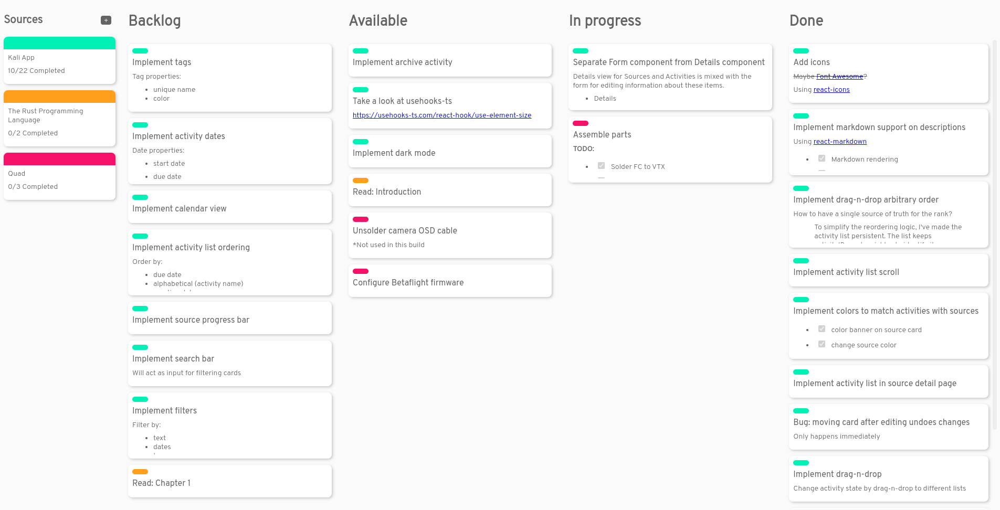

    

## About
Kali is an [Electron](https://www.electronjs.org/) Kanban app for individuals. Keep track of everything you are doing in a single screen, no boards.

## Features
- Keep your data with open formats and sync howerver you like
- No boards! Everything is kept in view (filtering coming soon™)
- Rich markdown support for documenting activities

## Planned Features
- Tags
- Dark mode
- Calendar view
- Filtering tool
- Time tracking and analytics
- Notifications
- Reports
- Automation
- Custom workflows
